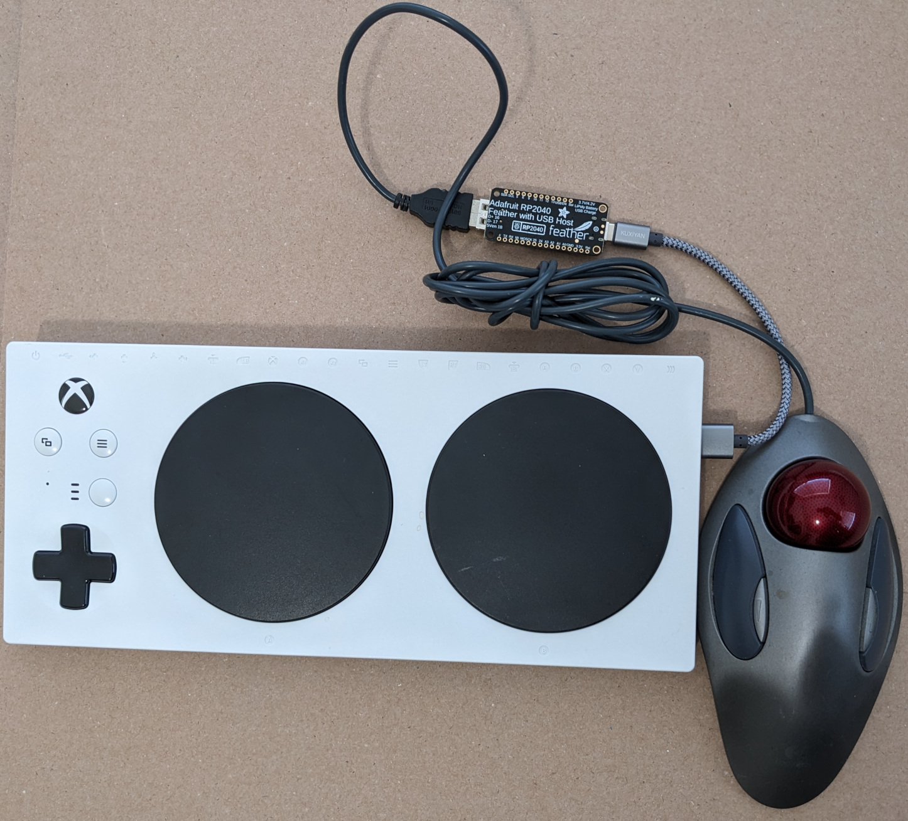

# USB Mouse to XAC Joystick

Translate USB mouse/trackball to USB joystick compatible with Xbox Adaptive
Controller. A Kensington trackball works well with this program. A large
trackball can be operated by foot, wrist, elbow, etc. Be sure to use a
5 volt, 2 amp power supply on the XAC.

The Perixx PeriPad 501 glidepad now works. Only a light touch is required
to move the joystick.

Be sure to use the Xbox joystick calibration to make full use of the pointing
device (mouse, trackball, or glidepad).

Tested with XAC firmware version 5.17.3202.0 (updated on May 25, 2023).

## Hardware

For Adafruit RP2040 Feather USB Host board. The board supports USB host
and device at the same time. Lots more information at https://learn.adafruit.com/adafruit-feather-rp2040-with-usb-type-a-host.

* Adafruit Feather RP2040 with USB Type A Host

## Dependencies

Use this board package.

* https://github.com/earlephilhower/arduino-pico

The following libraries can be installed using the IDE library manager.

* "Adafruit TinyUSB Library" by Adafruit
* "Pico PIO USB" by sekigon-gonnoc

The next must be downloaded as a ZIP file. Use the IDE "Add .ZIP Library" to
install it.

* https://github.com/touchgadget/flight_stick_tinyusb

## IDE Tools options required

* Set "Board" to "Adafruit Feather RP2040 USB Host"
* Set "USB Stack" to "Adafruit TinyUSB"
* Set "CPU Speed" to 120MHz.

## Troubleshooting

The Adafruit USB host board does not always recognize USB devices when plugged
in to its type A connector. Try plugging the USB mouse/trackball into the
Adafruit board before plugging the Adafruit board into the XAC. This seems to
work better.

Some USB devices require the XAC be powered by a 5 volt, 2 amp power supply.
For example, the large Kensington Trackball does not work without the power
supply.
